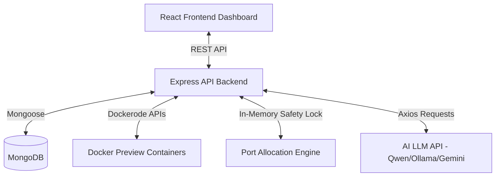

# DevOps AI Agent - Technical Architecture

This document describes the technical architecture of the DevOps AI Agent built inside the Next-Gen IDS/IPS and DevOps project.

---

## 1. System Topology Overview

The DevOps Agent integrates with the frontend client dashboard, backend API server, Docker process manager services, database servers, and AI LLM APIs to create a closed self-healing coding environment.

---

## 2. Component Design Details

### A. Frontend Panel Design
The frontend resides in [`Agent.jsx`](file:///d:/YASH/Final%20Year%20Projett/Web/frontend/src/pages/Agent.jsx) and implements a 3-panel IDE workspace layout:
- **Left Panel (Workspace Navigator)**:
  - Recursively fetches files and directories for the selected deployment through `GET /api/devops/:id/files`.
  - Lists database tables or MongoDB collections via `GET /api/devops/:id/db/collections`.
- **Center Panel (Interactive Editor / Grid)**:
  - **File Editor**: Opens code files in a textarea with real-time text updates. Saves edits directly to disk via `POST /api/devops/:id/files/save`.
  - **Live DB Grid**: Displays data records in tabular grids. Allows users to click "Add Document" and insert records using raw JSON schemas via `POST /api/devops/:id/db/insert`.
- **Right Panel (AI DevOps Assistant)**:
  - Integrates chatbot interactions using `POST /api/devops/:id/agent/chat` mapping to the active chat thread.
  - Implements execution permission banners (Ask, Always, Never) that prompt before running any `<exec>` script.

### B. Persistent Database Session Layers
To guarantee that chat context scales and persists across container restarts (e.g., when hosted on cloud platforms like Hugging Face), we track sessions in MongoDB:
- **`DevOpsChat` Schema**: Stores individual threads. Each thread contains an array of message nodes.
- **LLM Context Recall**: Before sending a query to the LLM, the backend queries the database for the active chat thread, slices the last 15 messages, converts them to standard `user`/`assistant` roles, and loads them into the LLM system prompts.

### C. Container Execution Engine & Self-Healing Loop
- **Code Patches**: LLM responses containing `<patch file="path">...</patch>` are parsed. The backend automatically writes these code modifications to the corresponding workspace directories.
- **Script Commands**: LLM responses containing `<exec command="..." />` are intercepted:
  - If `execPermission === 'ask'`: The backend skips execution and sends the command back to the client. The frontend prompts the user for confirmation.
  - Upon user approval (`Allow this time` or `Allow everytime`), the backend calls `POST /api/devops/:id/agent/exec-pending`.
  - The backend issues docker exec tasks using Dockerode, streaming terminal output logs back into the conversation logs.
- **Node & Python Compatibility**: The agent's system prompt restricts writing `.ts` files requiring global `ts-node` compilers. Instead, it creates plain JavaScript (`.js`) or Python (`.py`) scripts run via standard Node and Python runtimes available inside the preview container.

---

## 3. Concurrency Safety Layer
To support multiple developers running build preview containers at the same time:
- An in-memory `allocatedPorts` cache tracks active port reservations.
- Port numbers are requested in `suggestPort()` inside [`process-manager.service.js`](file:///d:/YASH/Final%20Year%20Projett/Web/backend/src/services/process-manager.service.js) and pre-reserved instantly to avoid collisions.
- Ports are released back to the free pool when preview containers are stopped or processes terminate.
