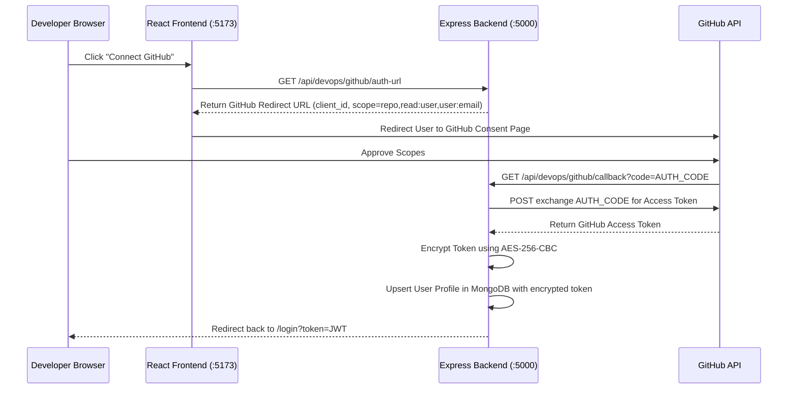

# GitHub OAuth Integration & DevOps Pipeline Guide

This guide documents the architecture, setup procedure, and code-level flow for the GitHub Repository Integration and developer Profile tools within the DevOps platform.

---

## 1. GitHub Developer Console Setup

To enable authentication and repository synchronization, a **GitHub OAuth App** is registered in the GitHub developer console:

1. **Navigate to:** `GitHub Settings` → `Developer Settings` → `OAuth Apps` → `New OAuth App`.
2. **Configuration Settings:**
   * **Application Name:** `DevOps Sandbox Platform`
   * **Homepage URL:** `http://localhost:5173` (Frontend address)
   * **Authorization Callback URL:** `http://localhost:5000/api/devops/github/callback` (Backend API redirect landing route)
3. **Credentials:** 
   * The console generates a unique `Client ID`.
   * Under **Client Secrets**, generate a new client secret token.
4. **Local Configuration:** Store the generated keys securely in the backend `.env` file:
   ```env
   GITHUB_CLIENT_ID=your_github_client_id
   GITHUB_CLIENT_SECRET=your_github_client_secret
   # Used for encrypting OAuth tokens before saving to database
   DB_ENCRYPTION_KEY=a3e8f8c9b1d0e8a7f6c5b4a3d2c1e0f9
   ```

---

## 2. Authentication & Data Fetch Flow (Backend)

The integration uses a secure flow to authorize profiles, decrypt access tokens in memory, and fetch branch data.



### AES-256-CBC Token Security
To protect developers' repository privileges, GitHub access tokens are encrypted before entering MongoDB.
* **Encryption Handler (`crypto`):** Uses a 32-byte key (`DB_ENCRYPTION_KEY`) and a random 16-byte Initialization Vector (IV).
* **Storage Format:** Saved as `iv_hex:encrypted_token_hex` in the `User` schema.
* **Auto-Decryption:** Mongoose getters decrypt the token on access inside controllers, leaving it unexposed on disk.

---

## 3. Developer Profile & Native Contribution Grid

Once linked, the `/profile` page shows the linked user accounts and contributions.

### Profile Dashboard Features
* **GitHub Sync Card:** Displays bio, location, company, follower counts, and public repository counts.
* **Repository Browser:** Lists up to 100 repositories. Provides a branch selector dropdown dynamically linked directly to the file browser: `https://github.com/{owner}/{repo}/tree/{branch}`.

### Native Contribution Calendar Grid
Rather than relying on third-party iframe embeds, the profile page queries GitHub's official **GraphQL API** using the developer's decrypted access token to pull actual contributions (including private workspace commits):
```graphql
query($username: String!) {
  user(login: $username) {
    contributionsCollection {
      contributionCalendar {
        totalContributions
        weeks {
          contributionDays {
            contributionCount
            date
            color
          }
        }
      }
    }
  }
}
```
* **Render Pipeline:** React maps this grid structure into columns (representing weeks) and squares (representing days).
* **Premium Styling:** Injects custom color palettes based on contribution density (ranging from dark grey squares up to bright cyan tiles).
* **Hover Tooltips:** Interactive cards reveal details such as `3 contributions on Nov 15, 2025` when hovering over a tile.

---

## 4. DevOps Import Panel & Configuration

The `/devops` route incorporates a GitHub import tab alongside the traditional ZIP upload.

### Custom Subfolder and Branch Extraction
* **Branch Selector:** When a repository is selected, the frontend triggers `getGithubBranches(owner, repo)`. The backend queries GitHub's repo endpoint and populates the dropdown list.
* **Subdirectory Selection:** Developers can enter a **Build Subdirectory** path (e.g. `server/` or `backend/`). The pipeline uses this to run builds inside subfolders of MERN monorepos.

### Custom `.env` Ingestion
Developers can add multiple custom environment variables inside the configuration panel before initiating a build:
* The `.env` variables are stored in the deployment history database records as an array: `envFiles: [{ path: '.env', content: '...' }]` (fully encrypted with AES-256-CBC).
* **Live Mismatch Warning:** If any entered variable (e.g., `CLIENT_URL`) has a localhost port that does not match the allocated Preview Port, a warning banner is shown, advising the developer to align the ports to prevent container socket refusal.

---

## 5. Build-Time Ingestion and Execution

Once the developer clicks **Import Repository**, the compiler executes the following tasks:

1. **Secure Download:** The backend retrieves the repository archive from GitHub's API using the developer's access token:
   ```javascript
   const downloadUrl = `https://api.github.com/repos/${owner}/${repo}/zipball/${branch}`;
   const response = await axios.get(downloadUrl, {
     headers: { Authorization: `token ${decryptedToken}` },
     responseType: 'arraybuffer'
   });
   ```
2. **Disk Extraction:** The fetched zipball is extracted to the host building directory:
   `DevOps/builds/${jobId}`.
3. **Environment Variable Injection:**
   * Before running Docker or compiling, the system writes the custom `.env` files.
   * **Smart Normalization:** The pipeline scans `.env` contents. If it detects key variables (like `PORT`, `CLIENT_URL`, `CORS_ORIGIN`), it automatically rewrites their port values to target the container's allocated preview port (e.g. `3001`).
   * This auto-healing prevents configuration errors from crashing the sandbox environment.
4. **Sandbox Startup:** The pipeline mounts the workspace folder, runs package installation with `--legacy-peer-deps`, compiles the build, and starts the container.
