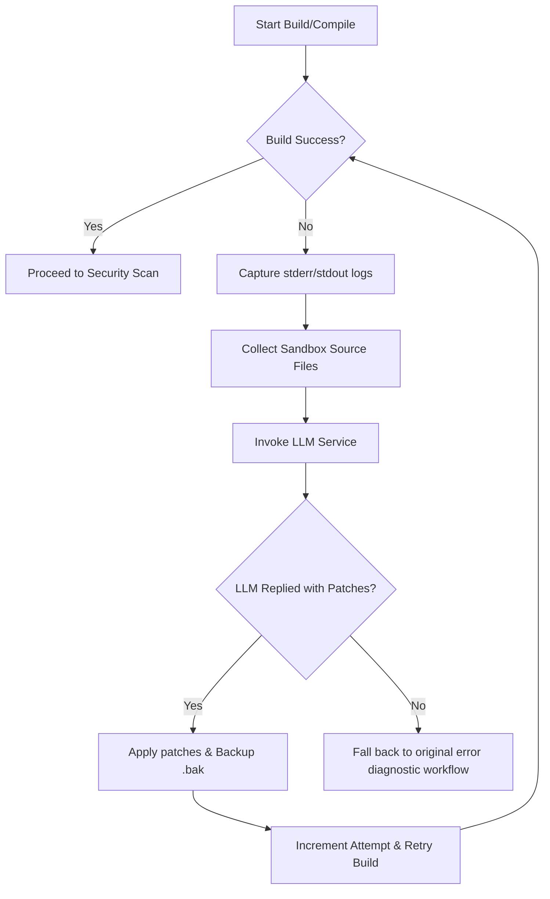

# DevOps Model Hosting & Self-Healing Agent Integration Guide

This guide details the architecture, local setup, and cloud integrations for model hosting used by the Self-Healing Build Agent in our DevOps deployment pipeline orchestrator.

---

## 1. Architecture Overview

The Self-Healing Build Agent acts as an automated compile-time interceptor. If a project compilation or dependency installation command fails in the containerized sandbox (or host runner), the build runner performs the following steps:



---

## 2. Option A: Local Hosting with Ollama (Zero Cost & Secure)

Local hosting executes the `qwen2.5-coder:7b` model locally on your workstation using **Ollama**. This requires no API keys, works offline, and guarantees code privacy.

### Installation

The start orchestrator script (`start-devops.sh`) will automatically check, install, and run Ollama if it is missing. However, to set it up manually:

* **Windows (PowerShell):**
  ```powershell
  irm https://ollama.com/install.ps1 | iex
  ```
* **Linux / macOS (Bash):**
  ```bash
  curl -fsSL https://ollama.com/install.sh | sh
  ```

### Managing Models

After installation, cache the Qwen 2.5 Coder model using:
```bash
ollama pull qwen2.5-coder:7b
```

### Hardware Recommendations
* **RAM:** Minimum 16GB.
* **GPU:** Dedicated GPU with at least 6GB VRAM (e.g. Nvidia RTX 3060/4060) is highly recommended for sub-10 second patch generations. If running on CPU-only, generation may take 1-2 minutes.

---

## 3. Option B: Cloud Hosting (High Performance)

For blazing-fast token generation and larger model capabilities, the pipeline dynamically routes requests to cloud providers if API credentials are configured in the environment.

### 1. Groq Cloud (Recommended)
* **Model:** `qwen-2.5-coder-32b`
* **Performance:** Blazing fast token generation speeds (200+ tokens/sec).
* **Setup:** Add the following keys to your backend `.env` file (`Web/backend/.env`):
  ```env
  GROQ_API_KEY=gsk_your_groq_api_key
  GROQ_MODEL=qwen-2.5-coder-32b
  ```

### 2. Hugging Face Serverless
* **Model:** `Qwen/Qwen2.5-Coder-32B-Instruct`
* **Setup:** Add the following keys to your backend `.env` file:
  ```env
  HUGGINGFACE_API_KEY=hf_your_huggingface_api_token
  HUGGINGFACE_MODEL=Qwen/Qwen2.5-Coder-32B-Instruct
  ```

---

## 4. Graceful Degradation & Fallback

If a developer teammate does not have Ollama installed or has not pulled the model, the app **will not crash**. 

The LLM service checks availability during liveness pre-flights:
- If a connection connection times out or throws `ECONNREFUSED` (meaning local Ollama is closed).
- Or if the requested model is missing from local cached tags.

The runner intercepts the exception, prints a warning message (`[SELF-HEALING] [Warning] Skipping self-healing: ...`), skips the retry loops, and falls back directly to the original compile failure output page with static diagnostics.
