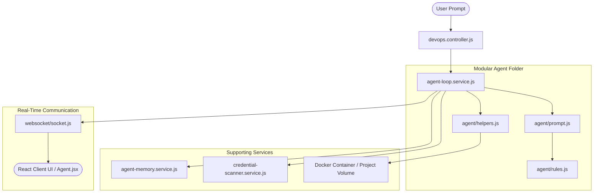

# DevOps AI Agent Services - Architecture & Interlinking

This document explains the internal design, interlinking, and step-by-step execution flow of the DevOps AI Workspace Agent backend services.

---

## 1. Architectural Overview & Component Interlinking

The AI agent operates using a **ReAct (Reasoning and Acting)** loop. It parses the project file tree, retrieves relevant memory context, compiles a dynamic system prompt based on the target technology stack, and executes tools (file changes and shell commands) directly inside a Docker preview container.



---

## 2. Core Service Breakdown

### A. Loop Orchestrator (`agent-loop.service.js`)
- **Role**: The main coordinator. It manages the iteration loop (up to 10 iterations) and controls the cycle of **Thought -> Action (Patch/Exec) -> Observation**.
- **State Management**: If the agent runs a modifying command (e.g. database seeding) in "Ask for permission" mode, this service saves the current ReAct loop history to Redis working memory, pauses execution, and returns a prompt response. Once the user clicks "Approve", the controller re-invokes this service to resume.

### B. System Prompt Generator (`agent/prompt.js`)
- **Role**: Assembles the instructions, package dependencies (`package.json`), and the active file list into the system prompt.
- **Interlinking**: Imports from `rules.js` to tailor constraints depending on the template runtime detected in the container.

### C. Stack-Specific Rules Compiler (`agent/rules.js`)
- **Role**: Prevents loop errors by tailoring the instructions. If the project uses Python, it allows Python seeders and pip packages. If the project uses Node.js, it disables Python, enforces CommonJS path translations (e.g., `./server/dist/models/`), and requires password-hashing (bcrypt) rules.

### D. Utility Helpers (`agent/helpers.js`)
- **Role**: Contains functions that interact with the system or the Docker environment:
  - `runCommandInContainer`: Spawns a shell execution inside the project's Docker container.
  - `isCommandSafe`: Validates commands against a shell injection/destruction blacklist (e.g., blocking `rm -rf /`, netcats, and host level docker.sock access).
  - `isReadOnlyCommand`: Filters commands like `cat`, `ls`, `grep` to run them immediately without prompting for user confirmation.
  - `getFlatWorkspaceFiles`: Scans directories to provide a file index for the prompt context, skipping build folders like `.venv` and `node_modules`.

### E. Memory Service (`agent-memory.service.js`)
- **Role**: Manages two types of memories:
  1. **Working Memory (Redis)**: Temporary cache to store intermediate ReAct loop states when a execution is paused for user permission.
  2. **Episodic Memory (MongoDB)**: Saves permanent chat history and retrieves semantically related past messages using similarity matches to improve prompt context.

### F. Security Credentials Scanner (`credential-scanner.service.js`)
- **Role**: Scans incoming code patches before they are written to disk. If the agent accidentally includes hardcoded passwords, tokens, or private keys, it blocks the write and raises a warning.

---

## 3. Real-World Execution Walkthrough

### Scenario
A user selects a **Python + PostgreSQL** build and submits the prompt:
> *"please add the users in the usr -and give me the password -so that i can check it on the login page"*

---

### Step-by-Step Data Flow

#### 1. Ingestion
The React UI sends the user message to the backend `/api/devops/chat` endpoint. The controller (`devops.controller.js`) fetches the build details, initializes the chat session, and runs:
```javascript
runAgentChatLoop(deployment, chatSession, "please add the users...");
```

#### 2. Prompt Compilation
The `agent-loop.service.js` fetches package files and workspace structures. It calls:
```javascript
const systemPrompt = generateSystemPrompt(deployment, pkgDetails, flatFilesList);
```
- Since the deployment template is `flask-postgres-app`, `rules.js` matches **Python** flags.
- It configures `RULE 2 — USE PYTHON FOR PYTHON PROJECTS`, instructing the model to use `python3` and write python files, and adds `RULE 12` to force write completion.

#### 3. ReAct Iteration 1: Locating models
- **Reasoning**: The model generates a thought: *"I need to insert a user. First I must find the model schemas to get the database layout and table details."*
- **Action**: Outputs `<exec command="find . -name '*.py' -not -path '*/.venv/*'" />`.
- **Execution**: `helpers.js` runs `isReadOnlyCommand("find...")` which returns `true` (safe to execute). It calls `runCommandInContainer` to query the container.
- **Observation**: Returns:
  ```
  ./app.py
  ./seed.py
  ```

#### 4. ReAct Iteration 2: Inspecting Schema
- **Reasoning**: *"Now I will read app.py to find the user registration fields and database setup."*
- **Action**: Outputs `<exec command="cat app.py" />`.
- **Observation**: The server returns the contents of `app.py` revealing the table structure (User model has columns `username` and `password` hashed using SHA-256).

#### 5. ReAct Iteration 3: Writing the script
- **Reasoning**: *"I will write a python script `seed_user.py` that connects to the database container `devops-db-postgres-jobId`, hashes the password 'pass123' with SHA-256, inserts the record, and prints the result."*
- **Action**: The agent generates a `<patch file="seed_user.py">` containing the Python script.
- **Safety check**: `credential-scanner.service.js` scans the code block. Since it is generating a mock password for test logins and not exposing system credentials, it passes.
- **Patch Application**: The file is written to the build workspace disk.

#### 6. ReAct Iteration 4: Execution
- **Reasoning**: *"Now I will execute the python seeder."*
- **Action**: Outputs `<exec command="python3 seed_user.py" />`.
- **Permission Check**: If permission mode is `always`, it runs. If it's `ask`, the orchestrator serializes the loop history to Redis and responds to the user asking for execution approval.
- **Output**: Once approved and executed, the command returns:
  ```
  User 'testuser' inserted successfully into Postgres!
  ```

#### 7. Final Output
The agent finishes reasoning: *"The user has been added. I will tell the user the login credentials."*
It responds:
> "I have added a test user. You can log in using:
> - **Username**: `testuser`
> - **Password**: `pass123`"
The WebSocket connection broadcasts the final state, collapses the thought dropdown showing the final duration, and the client UI updates cleanly.
